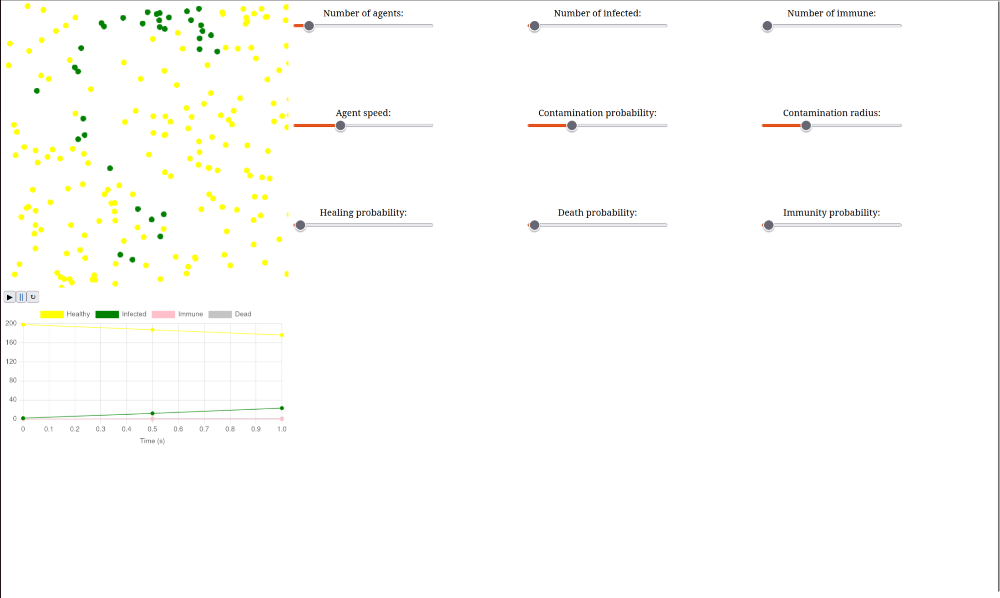

## EpidemySimulatorWASM

Multi-agent simulation engine (SIR model) compiled to WebAssembly. Implementation of a spatial grid for collision optimization and JS/C++ interfacing for real-time visualization.

## Requirements:
* vite version:>1.0.1
* pixi.js version:>8.12.0
* emcc version:>4.0.13
* node.js version:>20.19

## Installation (inside home directory):
```
npm install vite pixi.js
git clone https://github.com/emscripten-core/emsdk.git && cd emsdk
./emsdk install latest
./emsdk activate latest
```

## Local deployement (inside EpidemySimulatorWASM):

Steps for local deployment:
1. Compile the project to WebAssembly
Load the environment variables of emscripten:
```bash
source ~/emsdk/emsdk_env.sh
```

then compile the project

```bash
emcc --no-entry -O3 core/*.cpp -o src/wasm/epidemy.js -s MODULARIZE=1 -s EXPORT_ES6=1 -s EXPORTED_RUNTIME_METHODS='["cwrap","HEAPF64","HEAP32","HEAPU8"]' -s ALLOW_MEMORY_GROWTH=1
```

2. Launch the server with vite.js
```bash
npx vite
```

and open it in the browser at the address specified.

## Video

[](https://youtu.be/ASDd8G1p3JU)

## Illustrations


